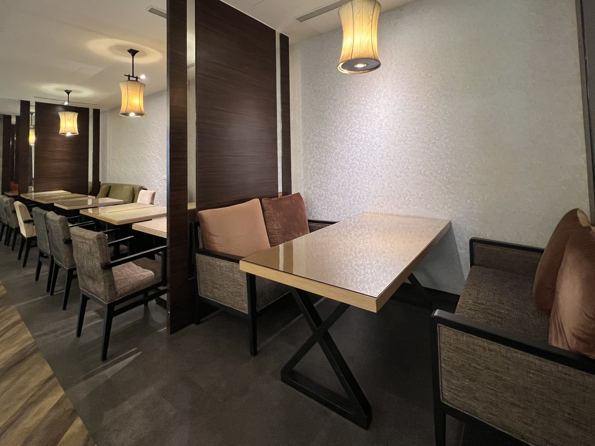

<html lang="zh-Hant">
<head>
  <meta charset="UTF-8" />
  <meta name="viewport" content="width=device-width, initial-scale=1.0" />
  <title>飯店大廳輪播</title>
  
</head>
<body>

  

    
    
    
  
  

  

</body>
</html>
