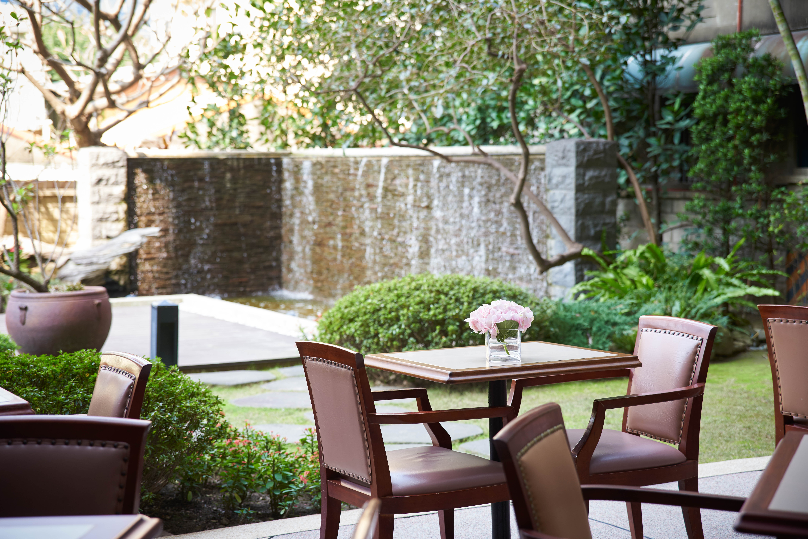

# solhotel
<!DOCTYPE html>
<html lang="zh-Hant">
<head>
  <meta charset="UTF-8" />
  <meta name="viewport" content="width=device-width, initial-scale=1.0" />
  <title>飯店大廳輪播</title>
  
</head>
<body>

  

    
    
    
    <iframe class="slide-frame" src="https://www.windy.com/zh-TW/-%E9%99%8D%E9%9B%A8%E3%80%81%E9%9B%B7%E6%9A%B4-rain?rain,26.372,138.120,5" title="圖4"></iframe>
  

  

</body>
</html>
